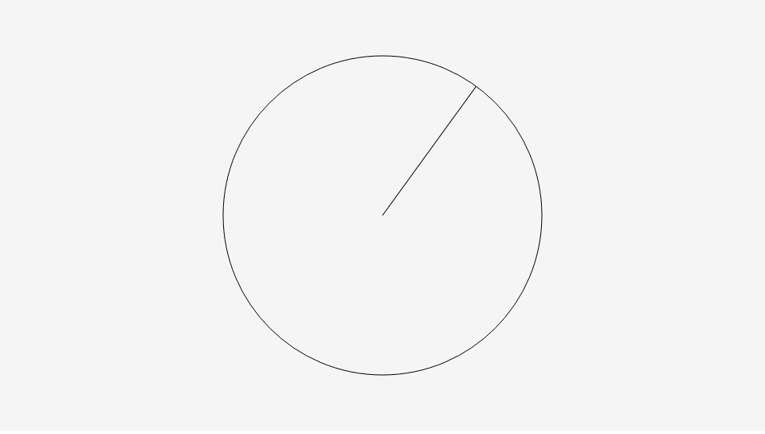
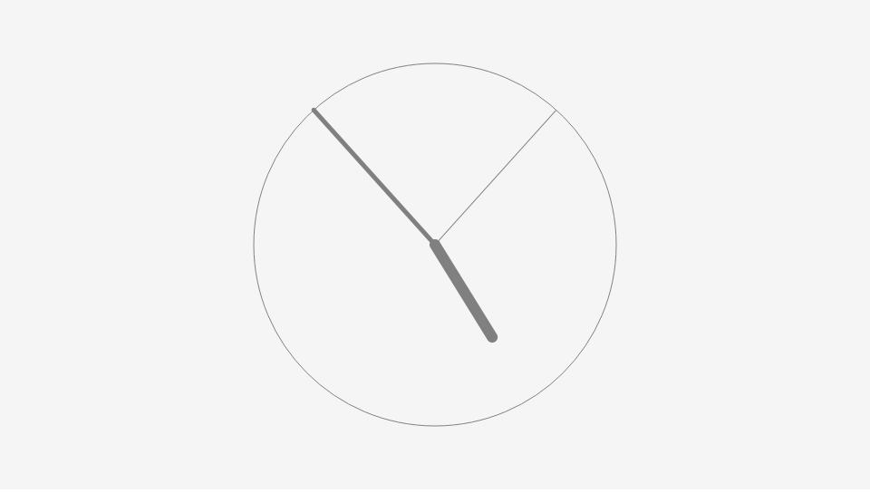
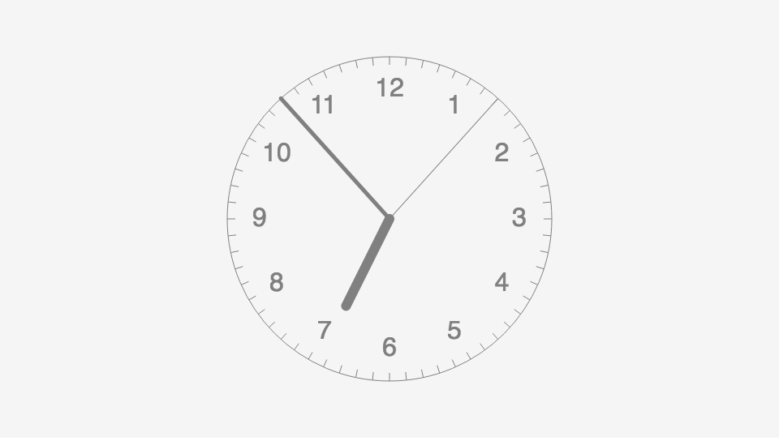

# アナログ時計を作ろう

アナログ時計の作成を通して、CreateJSの理解を深めましょう。

今回のサンプルとして紹介するアナログ時計の外観には目盛りが存在しますが、この目盛りは円周上に数多くの線を描く必要があります。これを手作業で作成するのは難しく手間がかかります。このような規則正しく多くのグラフィック要素を配置する必要のある場合にはスクリプトで実装するのが有効です。JavaScriptの `for` 文を使うと繰り返し処理によってルールに基づいたレイアウトができるようになります。

## 秒針を作成しよう



- [サンプルを再生する](https://ics-creative.github.io/tutorial-createjs/samples/clock_s.html)
- [サンプルのソースコードを確認する](../samples/clock_s.html)


アナログ時計の部分的なパーツの作成を通して、少しずつ実装していこう。まずは時計の土台部分を作成します。`createjs.Container`クラスを使って、コンテナーを用意しておきます。時計のパーツは円の中央を基準点として角度で制御することが多いため、コンテナーを用意しておくとこの後の制御が簡単になります。

```js
// コンテナーを作成します。
var clock = new createjs.Container();
clock.x = 960 / 2; // 画面中央に配置
clock.y = 540 / 2;
stage.addChild(clock);
```

次にアナログ時計の円盤を配置します。`addChild()`は`stage`ではなく、先程作成した`clock`としているのがポイントです。`clock`コンテナーの子供として円盤を追加しています。

```js
// 座布団を配置
var bg = new createjs.Shape();
bg.graphics
        .setStrokeStyle(1) // 線幅
        .beginStroke("black")// 線の色
        .drawCircle(0, 0, 200); // 円を描く
clock.addChild(bg);
```

秒針も同様の手順で作成します。アナログ時計における「0秒」のとき、秒針はどこを向いていますでしょうか。答えは「真上」ですが、スクリプトでも真上を向くように設定します。そのため円の中央から`lineTo()`メソッドで真上の座標まで線を描きます。

```js
// 秒針を配置
var sShape = new createjs.Shape();
sShape.graphics
        .setStrokeStyle(1) // 線幅
        .beginStroke("black")// 線の色
        .moveTo(0, 0) // 原点から
        .lineTo(0, -200); // 垂直上方向に線を描く
clock.addChild(sShape);
```

現在時刻をリアルタイムで取得するため、`tick`イベントを使います。`new Date()`を実行すると現在時刻を取得でき、続けて`getSeconds()`メソッドを使うと現在の秒を取得できます。

```js
// 時間経過のイベント
createjs.Ticker.addEventListener("tick", handleTick);
function handleTick() {
   // 現在時間を取得
   var now = new Date();

   // 時間の数値を取得
   var s = now.getSeconds(); // 秒(0〜59)

   // (省略)
}
```

変数`s`は`0〜59`までの数値になります。この数値を秒針の角度として設定しましょう。CreateJSでは円の一周は360度となるので、1秒あたりの角度は`(360度 ÷ 60分割) = 6度`となります。

```js
// 針の角度に反映する
// 秒針
sShape.rotation = s * (360 / 60);
```


## 分針と短針を作成しよう



- [サンプルを再生する](https://ics-creative.github.io/tutorial-createjs/samples/clock_smh.html)
- [サンプルのソースコードを確認する](../samples/clock_smh.html)


先程と同じ容量で短針と分針を作成します。短針は半径を短く設定しておきます。

```js
// 短針を配置
var hShape = new createjs.Shape();
hShape.graphics
        .setStrokeStyle(12, "round") // 線幅(端を角丸に)
        .beginStroke("gray")
        .moveTo(0, 0)
        .lineTo(0, -120); // 垂直上方向に線を描く
clock.addChild(hShape);

// 分針を配置
var mShape = new createjs.Shape();
mShape.graphics
        .setStrokeStyle(5, "round") // 線幅(端を角丸に)
        .beginStroke("gray")
        .moveTo(0, 0)
        .lineTo(0, -200); // 垂直上方向に線を描く
clock.addChild(mShape);
```

分針と短針も現在時刻から角度を求めます。`getHours()`メソッドで時間(0〜23)を取得でき、`getMinutes()`を使うと分(0〜59)を取得できます。この数字を使って分針と短針の角度を設定しましょう。注意したいのは短針で、以下を配慮する必要があります。

- 時間(0〜23)になるが、時間は0〜11で一周となる
- 短針は時間だけでなく、分も考慮した角度とする

具体的には次のコードで実装できます。短針の角度をもとめる部分の処理は、少し複雑になりますが理解しておきましょう。

```js
// 現在時間を取得
var now = new Date();

// 時間の数値を取得
var h = now.getHours(); // 時間(0〜23)
var m = now.getMinutes(); // 分(0〜59)
var s = now.getSeconds(); // 秒(0〜59)

// 針の角度に反映する
// 秒針
sShape.rotation = s * (360 / 60);
// 分針
mShape.rotation = m * (360 / 60);
// 短針 (短針は時間だけでなく分も角度に考慮する)
hShape.rotation = h * (360 / 24 / 2) + m * (360 / 24 / 60);
```


## 目盛りをスクリプトで描こう




- [サンプルを再生する](https://ics-creative.github.io/tutorial-createjs/samples/clock_smh_scale.html)
- [サンプルのソースコードを確認する](../samples/clock_smh_scale.html)


時計の円周上の目盛り線をJavaScript命令(CreateJS)を使って動的に描きましょう。円周上のグラフィックを描くときに便利なのは極座標の考え方です。極座標とは半径と角度の2つのパラメーターでXY座標を決定できる数学上の計算方法です。時計の目盛りは円周上に等間隔に描く必要がありますが、極座標の角度パラメーターを`for`文で変化させることで描けます。

円周上の目盛りの線は、円の内側から円周に向かって描きます。図のA点とB点の座標は次の計算式で求めることができます。A点とB点のXY座標を求めたら、CreateJSの`moveTo()`メソッドと`lineTo()`メソッドを使って2点を結んだ線分を描きます。

```js
// 目盛りを描画
var steps = 60; // 目盛りの個数
// (1周=360度=2πはstepsの値で分割)
for (var i = 0; i < steps; i++) {
    var angle = i * (360 / steps) - 90; //角度を計算
    var radian = angle * Math.PI / 180; // ラジアンに変換
    // A点 (直交座標に変換)
    var startX = 190 * Math.cos(radian);
    var startY = 190 * Math.sin(radian);
    // B点 (直交座標に変換)
    var endX = 200 * Math.cos(radian);
    var endY = 200 * Math.sin(radian);

    // 目盛りを描く
    bg.graphics
            .setStrokeStyle(1) // 線幅
            .beginStroke("gray")// 線の色
            .moveTo(startX, startY)
            .lineTo(endX, endY);
}
```


同様の手順で時計の文字を配置しよう。文字は`createjs.Text`クラスを使って配置します。テキストは垂直・水平方向でセンタリングしたいので、`textAlign`と`textBaseline`プロパティーの設定を忘れずに設定しておこう。

```js
// 数字を配置
var steps = 12; // 目盛りの個数
for (var i = 0; i < steps; i++) {
    // 角度を計算
    var angle = i * (360 / steps) - 90; // 開始座標を90度ずらす
    var radian = angle * Math.PI / 180; // ラジアンに変換
    // 配置座標 (直交座標に変換)
    var xx = 160 * Math.cos(radian);
    var yy = 160 * Math.sin(radian);

    // 表示する文字
    var moji = i;
    // アナログ時計は「0」時と表示しないので、「12」時に設定する
    if(i == 0){
        moji = 12;
    }

    // テキスト表示
    var t = new createjs.Text("", "32px sans-serif", "gray");
    t.text = moji;
    t.textAlign = "center"; // 水平中央に
    t.textBaseline = "middle"; // 垂直中央に
    t.x = xx; // 座標を設定
    t.y = yy;
    clock.addChild(t);
}
```

いかがでしたでしょうか。目盛りをより細かく描くと機械式時計のような細かい円盤をデザインすることができます。ここで紹介した方法を工夫してぜひオリジナルの時計の表現にチャレンジしてみてください。

書籍[「Flash for HTML5 ―HTML5開発環境としてのFlash Pro CC活用テクニック」](http://www.amazon.co.jp/dp/B014VWO2BU)では、このグラフィックの作り方を紹介しています。

- [サンプル](http://book.mynavi.jp/wd/sampledata/201503view/flash4html5/sample_3/clock_watch.html)

[目次に戻る](index.md)
