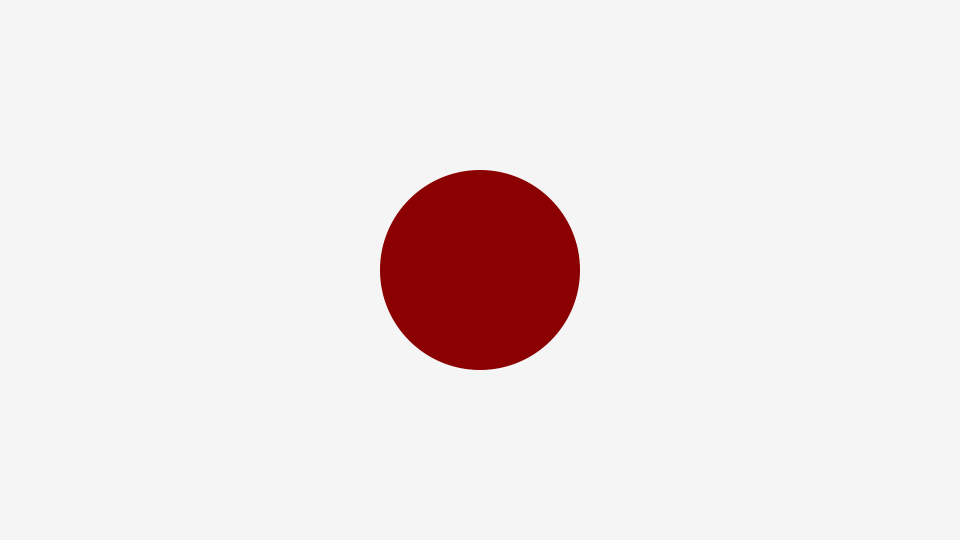

# CreateJS のドラッグ＆ドロップの実装方法

ドラッグ＆ドロップを実装する方法を紹介します。



- [サンプルを再生する](https://ics-creative.github.io/tutorial-createjs/samples/mouse_drag.html)
- [サンプルのソースコードを確認する](../samples/mouse_drag.html)

## マウスドラッグのイベント

CreateJSでマウスドラッグを実装する方法は次の3つのイベントを使うことです。

- `mousedown`イベントは対象物を押したときだけ発生 (一度だけ発生)
- `pressmove`イベントは対象物を押した状態でマウスを移動したときに発生 (連続して発生します)
- `pressup`イベントは対象物を押した状態からマウスを離したときに発生 (一度だけ発生)

書式

```js
// インタラクティブの設定
ball.addEventListener("mousedown", handleDown);
ball.addEventListener("pressmove", handleMove);
ball.addEventListener("pressup", handleUp);

// ボールを押したときの処理です
function handleDown(event) {
}

// ボールを押した状態で動かしたときの処理です
function handleMove(event) {
}

// ボールからマウスを離したときの処理です
function handleUp(event) {
}
```

## ドラッグの実装方法

ドラッグ&ドラッグを最もシンプルに実装するには`pressmove`イベントを使います。次のコードではドラッグ中に表示オブジェクトが追随することが確認できるでしょう。

```js
// インタラクティブの設定
表示オブジェクト.addEventListener("pressmove", handleMove);

// 表示オブジェクトを押した状態で動かしたときの処理です
function handleMove(event) {
	// 表示オブジェクトはマウス座標に追随する
	表示オブジェクト.x = stage.mouseX;
	表示オブジェクト.y = stage.mouseY;
}
```

しかし、ドラッグ＆ドロップできているとはいえ、ドラッグ中のマウスが常に表示オブジェクトの基準点に配置されます。これは不自然な挙動ではないでしょうか。

それを解消するには`mousedown`イベントも使います。次のコードで`mousedown`イベントでドラッグを開始した座標を計算しているのは、`pressmove`イベントで座標を設定するときに補正するためです。

```js
// ドラッグした場所を保存する変数
var dragPointX;
var dragPointY;

(省略)

// インタラクティブの設定
表示オブジェクト.addEventListener("mousedown", handleDown);
表示オブジェクト.addEventListener("pressmove", handleMove);

// 表示オブジェクトを押したときの処理です
function handleDown(event) {
	// ドラッグを開始した座標を覚えておく
	dragPointX = stage.mouseX - 表示オブジェクト.x;
	dragPointY = stage.mouseY - 表示オブジェクト.y;
}

// 表示オブジェクトを押した状態で動かしたときの処理です
function handleMove(event) {
	// 表示オブジェクトはマウス座標に追随する
	// ただしドラッグ開始地点との補正をいれておく
	表示オブジェクト.x = stage.mouseX - dragPointX;
	表示オブジェクト.y = stage.mouseY - dragPointY;
}
```


[目次に戻る](index.md)
