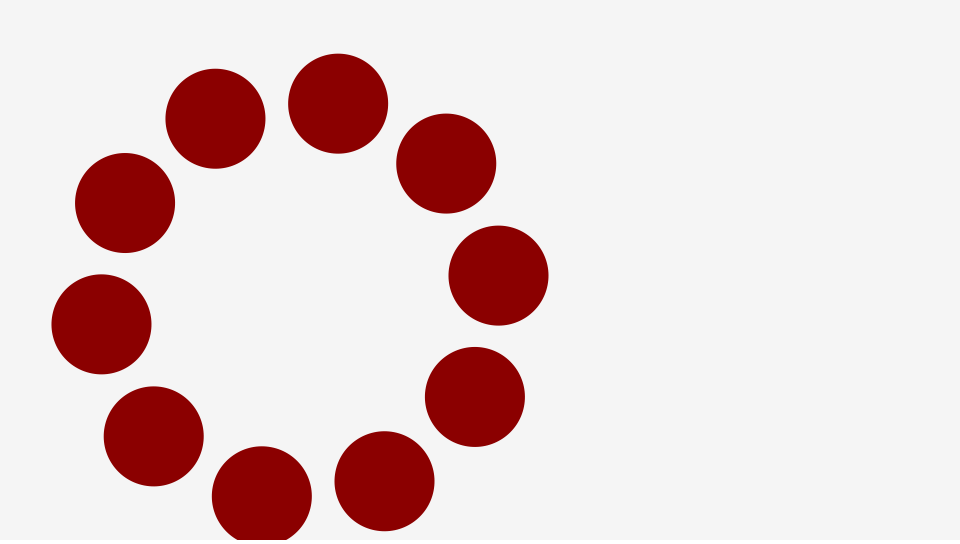

# 表示オブジェクトのネスト

表示オブジェクトは親のプロパティーによって、子の表示も影響を受けるので、グループ化して表示の制御を行いたい場合にネスト（親子構造）を利用すると便利です。Containerクラスを使うことで表示オブジェクトのネストを作ることができます。Containerのインスタンスの中に、別のContainerインスタンスを追加することもできるので、何重にもネストすることが可能です。

▼書式
```js
var container = new createjs.Container();
container.addChild(表示オブジェクト);
stage.addChild(container);
```

サンプルでは、親となる入れ物(containerインスタンス)を用意して、そこに10個のShapeオブジェクトを円周上に配置するようにaddChild()メソッドを使って追加しています。tick()関数ではcontainerインスタンスしかrotationプロパティーを変化させていませんが、containerインスタンス内に追加したShapeオブジェクトがまとめて移動しています。このように表示オブジェクトをネストさせることで、まとめてオブジェクトの移動や回転、拡縮の制御が容易にすることができます。

▼サンプル

```html
<!DOCTYPE html>
<html>
<head>
	<meta charset="UTF-8">
	<title>EaselJS Sample</title>
    <script>var createjs = window;</script> <!-- 名前空間をグローバルに変更 -->
	<script src="http://code.createjs.com/easeljs-0.5.0.min.js"></script>
	<script>
		var container;
		var stage;
		function init() {
			// Stageの作成
			var canvas = document.getElementById("myCanvas");
			stage = new Stage(canvas);

			container = new Container();
			container.x = 300;
			container.y = 300;
			stage.addChild(container);

			// 10個、円を作成しcontainerに追加
			for (var i = 0; i < 10; i++) {
				var ball = new Shape();
				ball.graphics.beginFill("#FF0000").drawCircle(0, 0, 50);
				ball.x = 200 * Math.sin(i * 360 / 10 * Math.PI / 180);
				ball.y = 200 * Math.cos(i * 360 / 10 * Math.PI / 180);
				container.addChild(ball);
			}

			Ticker.setFPS(60);
			Ticker.addListener(window);
		}
		function tick() {
			container.rotation += 1; // 親だけを回転
			stage.update();
		}
	</script>
</head>
<body onload="init();">
	<canvas id="myCanvas" width="980" height="580"></canvas>
</body>
</html>
```



[サンプルを開く](../samples/container_nest.html)


▲複数のShapeオブジェクトが円周上を移動している


[目次に戻る](../ReadMe.md)