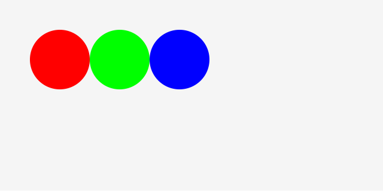

# CreateJS での色の指定方法

CreatJSでの色の指定方法を覚えましょう。CreateJSでは色を指定する方法がいくつかあります。

- 色の名前で指定 (例：green, red, blue)
- 16進数表記で指定 (例: #00ff00, #ff0000, #0000FF)
- RGB指定 (例: createjs.Graphics.getRGB(255, 0, 0))
- HSL指定 (例: createjs.Graphics.getHSL(255, 0, 0))

どの方法を選択するかはケースバイケースです。初心者の方は色の名前の指定だけ覚えておけばいいでしょう。色の名前だとバリエーションが限られるので、表現の自由度を広げたい場合はその他の方法を使えばいいでしょう。

## 色の名前で指定

```js
var shape = new createjs.Shape();
// 赤い円
shape.graphics.beginFill("red");
shape.graphics.drawCircle(100, 100, 50);
// 緑の円
shape.graphics.beginFill("green");
shape.graphics.drawCircle(200, 100, 50);
// 青い円
shape.graphics.beginFill("blue");
shape.graphics.drawCircle(300, 100, 50);
```


- [サンプルを再生する](https://ics-creative.github.io/tutorial-createjs/samples/color_name.html)
- [サンプルのソースコードを確認する](../samples/color_name.html)


使える色の名前はCSSの記法と同じです。次の記事を参考にするといいでしょう。

[CSS Color Names](http://memopad.bitter.jp/w3c/css/css_colornames.html)


## 16進数表記で指定

Web制作の色指定でもっとも使われる方法です。`#`につづけて色の16進数を指定します。色の16進数はPhotoshop等のソフトウェアで調べて使うといいでしょう。

```js
var shape = new createjs.Shape();
// 赤い円
shape.graphics.beginFill("#ff0000");
shape.graphics.drawCircle(100, 100, 50);
// 緑の円
shape.graphics.beginFill("#00ff00");
shape.graphics.drawCircle(200, 100, 50);
// 青い円
shape.graphics.beginFill("#0000ff");
shape.graphics.drawCircle(300, 100, 50);
```



- [サンプルを再生する](https://ics-creative.github.io/tutorial-createjs/samples/color_hex.html)
- [サンプルのソースコードを確認する](../samples/color_hex.html)


[CSS Color Names](http://memopad.bitter.jp/w3c/css/css_colornames.html)

## HSLで指定

HSLでの色の指定もできます。色相, 彩度, 明度を示し、それぞれは次の範囲のパラメーターを指定します。プログラミングで色相だけ変化させるときに役立ちます。

- 色相 (0〜360)
- 彩度 (0%〜100%)
- 明度 (0%〜100%)


```js
var shape = new createjs.Shape();
// 赤い円
shape.graphics.beginFill("hsl(0, 100%, 100%)");
shape.graphics.drawCircle(100, 100, 50);
// 緑の円
shape.graphics.beginFill("hsl(120, 100%, 100%)");
shape.graphics.drawCircle(200, 100, 50);
// 青い円
shape.graphics.beginFill("hsl(240, 100%, 100%)");
shape.graphics.drawCircle(300, 100, 50);
```


この他にCreateJSでは色相を設定できる命令として `createjs.Graphics.getHSL(h, s, l)` メソッドが用意されています。どちらの方法を使っても結果に差はありませんので、好みで選択するといいでしょう。


```js
// 赤い円 (色相, 彩度, 明度)
shape.graphics.beginFill(createjs.Graphics.getHSL(0, 100, 50));
shape.graphics.drawCircle(100, 100, 50);
// 暗い赤い円 (色相, 彩度, 明度)
shape.graphics.beginFill(createjs.Graphics.getHSL(0, 100, 20));
shape.graphics.drawCircle(200, 100, 50);
// 明るい赤い円 (色相, 彩度, 明度)
shape.graphics.beginFill(createjs.Graphics.getHSL(0, 100, 80));
shape.graphics.drawCircle(300, 100, 50);
```


- [サンプルを再生する](https://ics-creative.github.io/tutorial-createjs/samples/color_hsl.html)
- [サンプルのソースコードを確認する](../samples/color_hsl.html)
