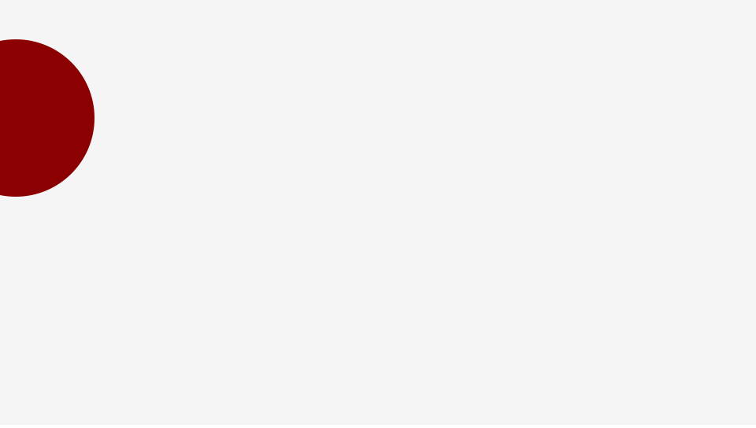

# CreateJS の Ticker の使い方

インタラクティブコンテンツを実装するためのアニメーション機構を備えています。`createjs.Ticker`クラスがアニメーションに必要な時間経過を管理するクラスとなります。`createjs.Ticker`クラスの`addEventListener()`メソッドで`tick`イベントを監視することによって関数を一定間隔で実行します。デフォルトでは1/24秒ごとに呼び出されます。

```js
createjs.Ticker.addEventListener("tick", handleTick);

function handleTick(){
    console.log( new Date() );
}
```

`tick()`関数内で、`stage.update()`メソッドを呼び出し、常にステージの画面更新が呼ばれるようにしておきましょう。

```js
createjs.Ticker.addEventListener("tick", handleTick);

function handleTick(){
    // 自分で実装したい処理
    stage.update();
}
```

例えば、tick()関数の中で動きを付けたい場合は次のように記述します。

▼サンプル
```js
var stage = new createjs.Stage("myCanvas");

// 円を作成します
var shape = new createjs.Shape();
shape.graphics.beginFill("red").drawCircle(0, 0, 100); //半径100pxの円を描画
shape.y = 150; // Y座標300の位置に配置
stage.addChild(shape); // 表示リストに追加

// tick イベントを監視します
createjs.Ticker.addEventListener("tick", handleTick);
function handleTick(){
	// アニメーション
	shape.x += 2;

	// Stageの描画を更新します
	stage.update();
}
```



- [サンプルを再生する](https://ics-creative.github.io/tutorial-createjs/samples/ticker.html)
- [サンプルのソースコードを確認する](../samples/ticker.html)


## コラム : createjs.Stage の自動更新

`createjs.Ticker`の`addEventListener()`メソッドの二番目の引数に`stage`オブジェクトを与えると、update()メソッドを呼びださなくても`stage`は常に描画更新されるようになります。

```js
createjs.Ticker.addEventListener("tick", stage);
```


サンプル

```js
var stage = new createjs.Stage("myCanvas");

// 円を作成します
var shape = new createjs.Shape();
shape.graphics.beginFill("red").drawCircle(0, 0, 100); //半径100pxの円を描画
shape.y = 150; // Y座標300の位置に配置
stage.addChild(shape); // 表示リストに追加

// 自動的に画面更新させます。
createjs.Ticker.addEventListener("tick", stage);

// tick イベントを監視します
createjs.Ticker.addEventListener("tick", handleTick);
function handleTick(){
	// アニメーション
	shape.x += 2;
}
```


- [サンプルを再生する](https://ics-creative.github.io/tutorial-createjs/samples/ticker_autoupdate.html)
- [サンプルのソースコードを確認する](../samples/ticker_autoupdate.html)


[目次に戻る](index.md)
